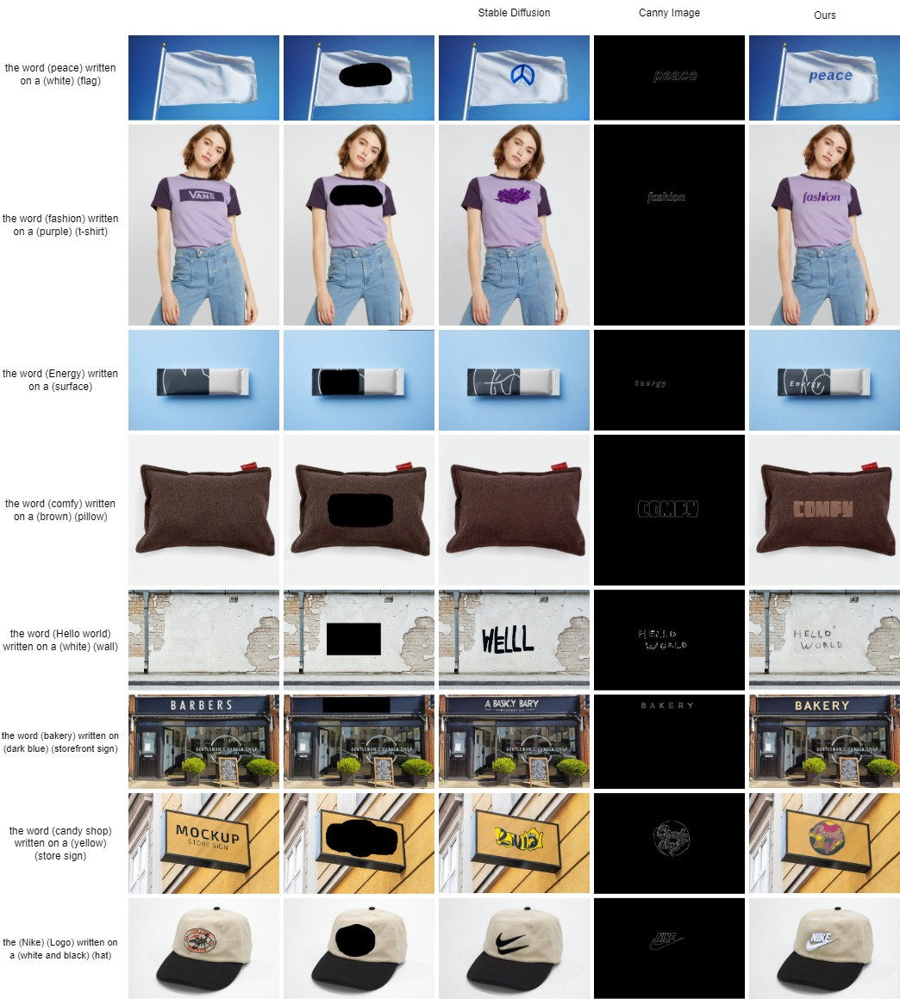

Code for paper [NO MORE BLAH-BLAH: EMBRACING REAL TEXT IN THE IMAGE SYNTHESIS WORLD](https://openreview.net/pdf?id=qjrvRK24S0).

This paper introduces a novel method to better integrate text into images, improving the appearance of text on objects.

Our Model Architecture: 

Results: 

